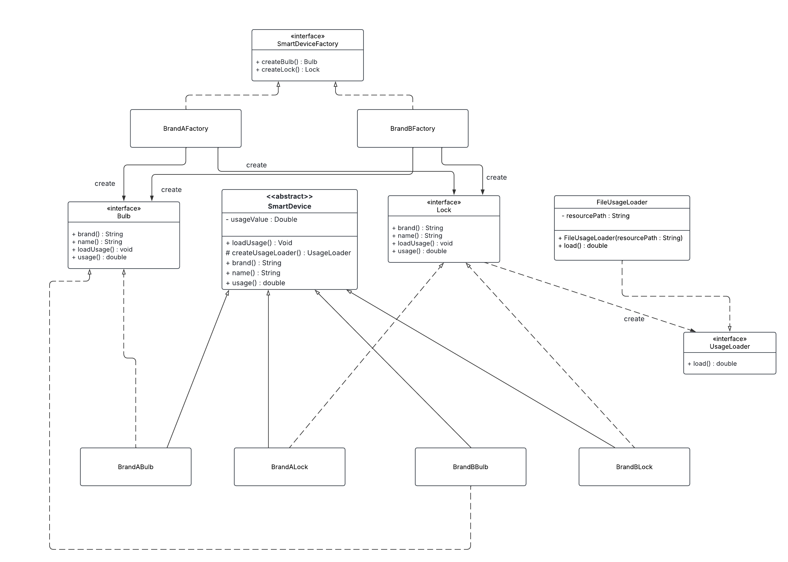
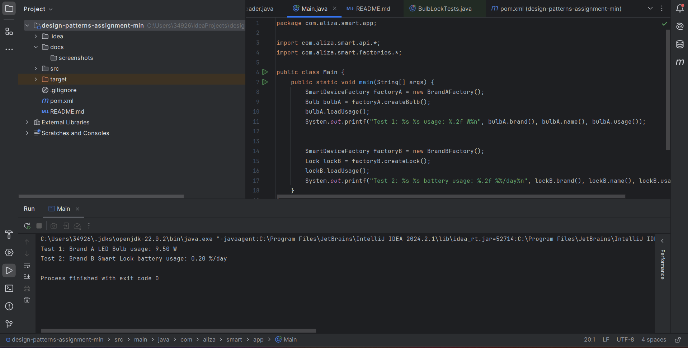
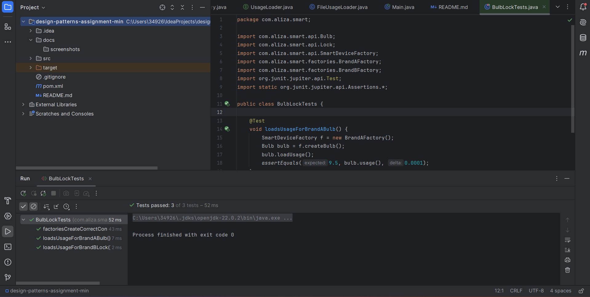

# Assignment 1 — Design Patterns

**Group 41:** Aliza Rizwan, Inshal Chaudhary, Zainab Lawal

**IDE:** IntelliJ IDEA (Maven project)

This project implements:

- **Abstract Factory** — `SmartDeviceFactory` creates a family of products (Bulb, Lock) for a brand via `BrandAFactory` and `BrandBFactory`.
- **Factory Method** — each product defers usage-data loading via `createUsageLoader()` (implemented by concrete products), which returns a `UsageLoader` (here, `FileUsageLoader`) to read values from tiny text files (simulating an external DB).

## Repository Structure
```text
design-patterns-assignment-min/
├─ pom.xml
├─ README.md
├─ docs/
│  ├─ uml.txt
│  └─ uml.plantuml
└─ src/
   ├─ main/
   │  ├─ java/
   │  │  └─ com/aliza/smart/
   │  │     ├─ api/
   │  │     │  ├─ Bulb.java
   │  │     │  ├─ Lock.java
   │  │     │  └─ SmartDeviceFactory.java
   │  │     ├─ devices/
   │  │     │  ├─ AbstractSmartDevice.java
   │  │     │  ├─ BrandABulb.java
   │  │     │  ├─ BrandALock.java
   │  │     │  ├─ BrandBBulb.java
   │  │     │  └─ BrandBLock.java
   │  │     ├─ factories/
   │  │     │  ├─ BrandAFactory.java
   │  │     │  └─ BrandBFactory.java
   │  │     ├─ usage/
   │  │     │  ├─ UsageLoader.java
   │  │     │  └─ FileUsageLoader.java
   │  │     └─ app/
   │  │        └─ Main.java
   │  └─ resources/
   │     └─ usage/
   │        ├─ brandA/
   │        │  ├─ bulb.txt
   │        │  └─ lock.txt
   │        └─ brandB/
   │           ├─ bulb.txt
   │           └─ lock.txt
   └─ test/
      └─ java/
         └─ com/aliza/smart/
            └─ BulbLockTests.java
```
## How to Run (IntelliJ)
1. Open **File → New → Project from Existing Sources…**, choose `pom.xml`.
2. Wait for Maven sync.
3. Run demo: open `Main.java` → ▶.
4. Run tests: right-click `test/java/com/aliza/smart` → **Run ‘Tests…’**.

## Demo Output
- **Brand A Bulb** loads watts from `usage/brandA/bulb.txt`.
- **Brand B Lock** loads %/day from `usage/brandB/lock.txt`.

## Tests
- `loadsUsageForBrandABulb()` → expects `9.5`.
- `loadsUsageForBrandBLock()` → expects `0.20`.
- `factoriesCreateCorrectConcreteTypes()` → sanity check.

## Screenshots
Here is the UML class diagram showing the Abstract Factory and Factory Method design:



Console output after running `Main.java`:



All unit tests passing in IntelliJ:


